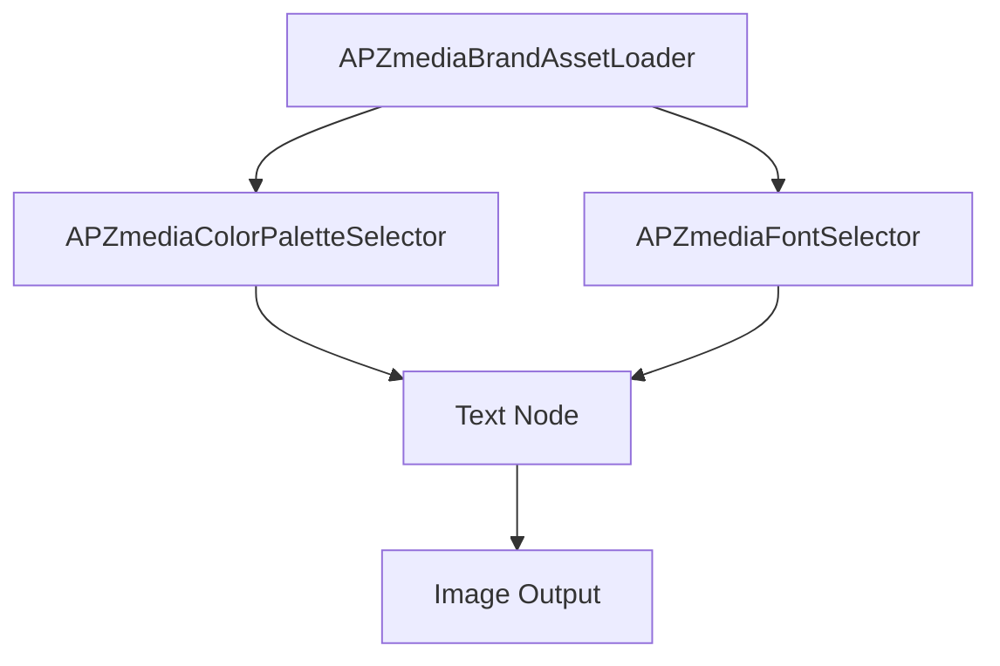
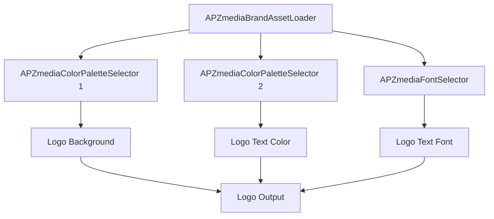
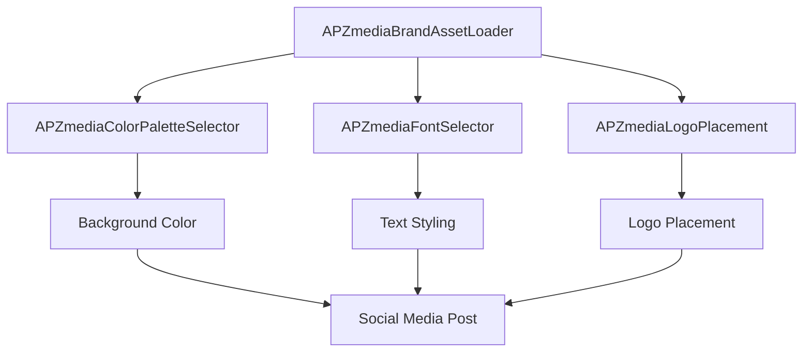

# Color and Font Selector Nodes - Usage Guide

## Overview

This guide provides comprehensive usage examples and workflow integration patterns for the APZmedia Color Palette Selector and Font Selector nodes. These nodes work together to provide seamless brand asset management in ComfyUI workflows.

## Quick Start

### Basic Workflow
1. Load brand assets using `APZmediaBrandAssetLoader`
2. Extract colors using `APZmediaColorPaletteSelector`
3. Extract fonts using `APZmediaFontSelector`
4. Apply assets to your content generation nodes

## Workflow Examples

### Example 1: Branded Text Generation



**Setup:**
1. **Brand Asset Loader**: Configure with your brand ID or manual paths
2. **Color Selector**: Select `color_1` (primary brand color)
3. **Font Selector**: Select `font_primary` (main brand font)
4. **Text Node**: Use color and font outputs for branded text

**Node Configuration:**
- Color Selector: `color_selection = "color_1"`
- Font Selector: `font_selection = "font_primary"`
- Text Node: Connect `color_hex` to color input, `font_path` to font input

### Example 2: Multi-Color Logo Design



**Setup:**
1. **Brand Asset Loader**: Load complete brand assets
2. **Color Selector 1**: Select `color_1` for background
3. **Color Selector 2**: Select `color_2` for text
4. **Font Selector**: Select `font_primary_bold` for logo text
5. **Logo Nodes**: Apply colors and font to logo generation

**Node Configuration:**
- Color Selector 1: `color_selection = "color_1"`
- Color Selector 2: `color_selection = "color_2"`
- Font Selector: `font_selection = "font_primary_bold"`

### Example 3: Branded Social Media Post



**Setup:**
1. **Brand Asset Loader**: Load brand assets
2. **Color Selector**: Select `color_1` for post background
3. **Font Selector**: Select `font_secondary` for body text
4. **Logo Placement**: Use brand logo for placement
5. **Post Generation**: Combine all elements

## Advanced Usage Patterns

### Pattern 1: Dynamic Color Theming

**Use Case**: Generate content with different color themes based on context

**Implementation:**
```python
# Multiple color selectors for different themes
color_selector_primary = APZmediaColorPaletteSelector()
color_selector_secondary = APZmediaColorPaletteSelector()

# Configure for different contexts
color_selector_primary.color_selection = "color_1"  # Primary theme
color_selector_secondary.color_selection = "color_2"  # Secondary theme
```

**Workflow:**
1. Create multiple color selector nodes
2. Configure each for different color selections
3. Use conditional logic to switch between themes
4. Apply appropriate colors to content

### Pattern 2: Font Hierarchy Management

**Use Case**: Apply consistent font hierarchy across multiple text elements

**Implementation:**
```python
# Font selectors for different text levels
font_selector_heading = APZmediaFontSelector()
font_selector_body = APZmediaFontSelector()
font_selector_caption = APZmediaFontSelector()

# Configure font hierarchy
font_selector_heading.font_selection = "font_primary_bold"
font_selector_body.font_selection = "font_secondary"
font_selector_caption.font_selection = "font_tertiary"
```

**Workflow:**
1. Create font selectors for each text level
2. Configure appropriate font selections
3. Apply fonts to corresponding text elements
4. Maintain consistent hierarchy

### Pattern 3: Custom Override System

**Use Case**: Allow custom colors and fonts while maintaining brand consistency

**Implementation:**
```python
# Color selector with custom override
color_selector = APZmediaColorPaletteSelector()
color_selector.use_custom = True
color_selector.custom_color = "#FF5733"  # Custom orange

# Font selector with custom override
font_selector = APZmediaFontSelector()
font_selector.use_custom = True
font_selector.custom_font_path = "/path/to/custom-font.ttf"
```

**Workflow:**
1. Configure selectors with custom overrides
2. Use custom values when needed
3. Fall back to brand assets when custom not specified
4. Maintain brand consistency as default

## Integration with ComfyUI Nodes

### Text Nodes
- **Color Input**: Connect `color_hex` from color selector
- **Font Input**: Connect `font_path` from font selector
- **Style Input**: Use `color_info` and `font_info` for debugging

### Image Nodes
- **Background Color**: Use `color_hex` for background colors
- **Overlay Colors**: Apply colors to overlays and effects
- **Text Overlay**: Combine color and font for text overlays

### Logo Nodes
- **Logo Colors**: Use brand colors for logo backgrounds
- **Logo Text**: Apply brand fonts to logo text
- **Logo Styling**: Use color and font for consistent logo appearance

## Best Practices

### Color Management
1. **Consistent Selection**: Use the same color selection across related nodes
2. **Color Validation**: Always check `color_info` for validation status
3. **Fallback Handling**: Implement fallback colors for missing selections
4. **Custom Overrides**: Use custom colors sparingly and document reasons

### Font Management
1. **Hierarchy Consistency**: Maintain consistent font hierarchy across content
2. **Font Validation**: Check `font_info` for font loading status
3. **Fallback Fonts**: Implement fallback fonts for missing selections
4. **Custom Fonts**: Validate custom font paths before use

### Workflow Organization
1. **Group Related Nodes**: Keep color and font selectors near their usage
2. **Label Connections**: Use descriptive names for connections
3. **Document Customizations**: Note any custom overrides and reasons
4. **Test Workflows**: Validate workflows with different brand assets

## Troubleshooting Common Issues

### Color Issues
- **"No color found"**: Check palette JSON format and color selection
- **"Invalid color hex"**: Verify hex format and color values
- **Empty color output**: Check brand asset loading and JSON structure

### Font Issues
- **"No font found"**: Verify brand assets contain font data
- **"Invalid font path"**: Check font file existence and permissions
- **Empty font output**: Validate brand asset structure and font keys

### Integration Issues
- **Connection errors**: Check node input/output types
- **Workflow failures**: Validate all required inputs are connected
- **Performance issues**: Optimize workflow by reducing unnecessary nodes

## Performance Optimization

### Efficient Workflows
1. **Reuse Selectors**: Use the same selector for multiple outputs
2. **Batch Processing**: Process multiple items with same selections
3. **Cache Results**: Store frequently used color/font combinations
4. **Minimize Custom Overrides**: Use brand assets when possible

### Memory Management
1. **Clean Connections**: Remove unused connections
2. **Optimize JSON**: Use compact JSON for color palettes
3. **Font Caching**: Cache font information for repeated use
4. **Error Handling**: Implement proper error handling to prevent crashes

## Example Workflows

### Workflow 1: Branded Business Card
```
Brand Asset Loader → Color Selector (primary) → Background
                 → Font Selector (primary) → Company Name
                 → Font Selector (secondary) → Contact Info
                 → Logo Placement → Final Card
```

### Workflow 2: Social Media Banner
```
Brand Asset Loader → Color Selector (accent) → Background
                 → Color Selector (text) → Text Color
                 → Font Selector (primary_bold) → Headline
                 → Font Selector (secondary) → Body Text
                 → Logo Overlay → Banner Output
```

### Workflow 3: Product Mockup
```
Brand Asset Loader → Color Selector (primary) → Product Color
                 → Font Selector (primary) → Product Name
                 → Font Selector (secondary) → Description
                 → Logo Placement → Mockup Output
```

## Advanced Configuration

### Custom Color Palettes
```json
{
  "colors": [
    {"name": "Brand Primary", "hex": "#1E3A8A", "id": "primary"},
    {"name": "Brand Secondary", "hex": "#059669", "id": "secondary"},
    {"name": "Brand Accent", "hex": "#EA580C", "id": "accent"},
    {"name": "Brand Neutral", "hex": "#6B7280", "id": "neutral"},
    {"name": "Brand Success", "hex": "#10B981", "id": "success"},
    {"name": "Brand Warning", "hex": "#F59E0B", "id": "warning"},
    {"name": "Brand Error", "hex": "#EF4444", "id": "error"}
  ]
}
```

### Font Asset Structure
```python
brand_assets = {
    "font_primary": "/brand/fonts/primary-regular.ttf",
    "font_primary_bold": "/brand/fonts/primary-bold.ttf",
    "font_primary_italic": "/brand/fonts/primary-italic.ttf",
    "font_secondary": "/brand/fonts/secondary-regular.ttf",
    "font_secondary_bold": "/brand/fonts/secondary-bold.ttf",
    "font_secondary_italic": "/brand/fonts/secondary-italic.ttf",
    "font_tertiary": "/brand/fonts/tertiary-regular.ttf",
    "font_tertiary_bold": "/brand/fonts/tertiary-bold.ttf",
    "font_tertiary_italic": "/brand/fonts/tertiary-italic.ttf"
}
```

## Support and Resources

### Documentation
- Color Palette Selector: `COLOR_PALETTE_SELECTOR_DOCUMENTATION.md`
- Font Selector: `FONT_SELECTOR_DOCUMENTATION.md`
- API Reference: See individual node documentation

### Troubleshooting
- Check node outputs for error messages
- Validate input data formats
- Enable debug logging for detailed information
- Review workflow connections and data flow

### Community
- Report issues through project repository
- Share workflow examples and improvements
- Contribute to documentation and examples


